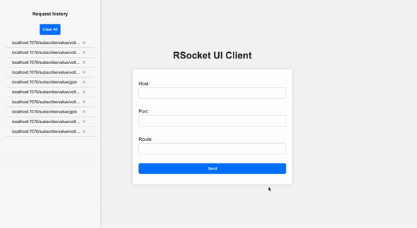

# RSocket Client

## Introduction
RSocket Client is an application designed to broadcast data received from an RSocket in the browser, Postman, and any other client supporting event stream.
It essentially transfers data from RSocket to an event stream flow, doing nothing more. This project was inspired by the lack of a simple client for visualizing RSocket data. 
Currently, the application supports interactions with RSocket producers only through TCP and is limited to request-stream interactions.

## Technology Stack
- Kotlin 1.9.22
- Spring Boot 3.2.2
- WebFlux
- Coroutines
- R2DBC
- H2 Database
- RSocket

## Features
- The application boasts a simple UI, where users need to fill in the data of the RSocket producer: host, port, and route. A screenshot will follow.
- Data can also be fetched using an API. To request data, send a GET request to `/route`. An example request will be provided below.
- Client stores a history of requests.

## How to run
To start using RSocket Client, you can simply run the Docker container. Use the following command to run the container

```shell
docker run -p 8080:8080 --name rsocket-client ngnhub/rsocket-client:latest
```
## Usage
The application supports two modes of interaction: API and UI.<p>

### API

The API accepts a request on `POST /route` with the following JSON body:

```json
{
  "host": "localhost",
  "port": "7070",
  "route": "subscribe/value/voltage"
}
```
Host and port fields are mandatory. If the route path is root, route can be empty.

#### Example
```shell
curl --location 'http://localhost:8080/route' \
--header 'Content-Type: application/json' \
--data '{
    "host": "localhost",
    "port" : "7070",
    "route" : "subscribe/value/voltage"
}'
```

### UI

The UI interacts with the RSocket by processing an HTML form. Users can fill in the details of the RSocket producer (host, port, and route)
directly in the form, and upon submission, a request is made to the RSocket producer. This allows for a user-friendly 
way to initiate the data streaming from the specified RSocket route. If you've run the app container on 8080 port, go to 
http://localhost:8080.

#### Example


## Future Implementations (TBD)
* Request-response handling
* Fire-and-forget messages
* Bidirectional messages
* Authentication (if required)